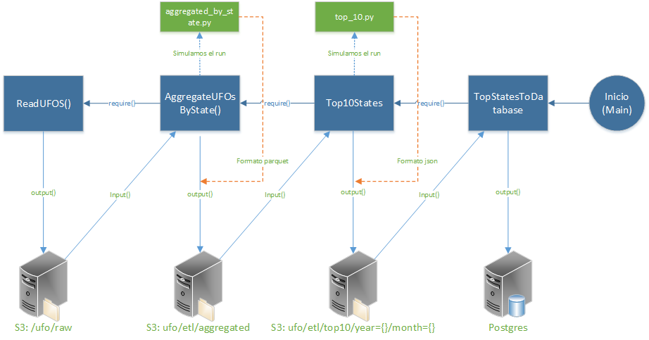

# Quién es Luigi??? El compañero de Mario Bros???
Exacto.. es un plomero que es amigo de Mario Bross... Luigi arregla las tuberías (pipeline)

En el ambiente de Big Data, Luigi es un orquestador... **WTF??** mmm imaginen que tienen muchas tareas dependientes unas de otras, y tienen muchos trabajadores (luigis workers) dispuestos a ayudar..... Entonces... Luigi (Master, osea papá de los pollitos) es quién les distribuye el trabajo, conforme se vayan desocupando y lleva el control de los procesos, las tareas y los trabajadores......
Ah... por cierto... fue desarrollado por **Spotify**

Luigi trabaja básicamente con Target, Task y Parameters...
* Target -> Lugares de almacenamiento para extraer o resguardar la información, pueden ser locales, s3(amazon), hadoop, etc...
* Task -> Son las encargadas de ejecutar y generalmente tiene los métodos: 
 - Input -> Es la salida(output) de la tarea anterior ( se define en la sección de require)
 - Output -> El archivo de salida de la tarea, generalmente se define un target.
 - Run -> Aquí es donde sucede la magia.... si si si... osea aquí va el código que se ejecuta
 - Require -> Requiere una tarea anterior... 
``` python
class AggregateUFOsByState(SparkSubmitTask):
    sighting = luigi.DateParameter(default=datetime.date.today())
    bucket = configuration.get_config().get('etl','bucket')

    def requires(self):
        return ReadUFOs()

    @property
    def name(self):
        return 'AggregateUFOsBystate'

    def app_options(self):
        return [self.input().path, self.output().path]

    @property
    def app(self):
        return 'aggregate_by_state.py'


    def output(self):
        return luigi.s3.S3Target(self.bucket + '/ufo/etl/aggregated')
```
En el código anterior, en lugar de tener el método Run, sacamos el código a ejecutarse y lo colocamos en el archivo aggregated_by_state.py , y eso cómo para qué?? ah.. para que se vea bonito ah.. just kidding, además de que se ve mas limpio el código, nos permite hacer cambios rápidos... por ejemplo, si queremos modificar algo, bastaría con modificar el archivo aggregated_by_state.py, de lo contrario tendríamos que detener el luigi, modificar el archivo principal, en nuestro caso etl.py y volver a arrancar a luigi... es una pachanga, no???

Supongamos que queremos guardar el top ten de avistamiento de ufos por estados en una base de datos de postgres, para lo cuál tenemos las siguientes tareas:
* Leer los archivos con los avistamientos -> ReadUFOS()
* Agrupamos la información por estados -> AggregatedUFOSbySate()
* Sacamos el top ten de cada uno -> TopTenStates
* Guardamos el top ten en una bd de postgres -> TopStatesToDatabase()

En Luigi tenemos que pensar al revés... empezamos por el resultado, programamos de la última función a la primera.



#Ambiente para luigi
* Prerrequisitos
 - Tener instalados docker, docker-compose y git( clonado github.com/ITAM-DS/data-product-architecture.git)
 - Tener actualizado el repositorio (remoto y origin master)
 - Tener el archivo *.pem, las credenciales de entrada de aws y configurarlas para conectarse (aws config)
 - Tener las llaves generadas de ssh (id_rsa e id_rsa.pub) y haber configurado el ambiente para conectarse a github utilizando ssh.
 - Tener el siguiente archivo en la carpeta **producto/ambiente**
   * .env
 - Modificamos el archivo de Dockerfile que está en la carpeta **producto/ambiente/docker-images/luigi_worker**; 
  ```shell  
  ##Clonamos el repositorio
  RUN git clone git@github.com:TuUsuario/data-product-architecture.git
  ```
 - Tener los siguientes archivos en la carpeta **producto/ambiente/docker-images/luigi_worker**
   * dpa_rsa <- es el mismo que el id_rsa, solo hay que renonmbrarlo y copiarlo aquí.
    * .boto

Y cómo lo corremos? dónde se ejecuta? Si es la primera vez que se levanta el ambiente, ir a la carpeta **producto/ambiente** ejecutar
```shell
$ sudo docker-compose build
$ sudo docker-compose up -d postgres spark_worker luigid
```
Si ya existen los ambientes, hay que detenerlos, borrarlos y volverlos a construir
```shell
$ sudo docker-compose rm --force luigi_worker
$ sudo docker-compose build --force-rm --no-cache luigi_worker
```
Solamente levantamos postgres spark y luigi
```shell
docker-compose up -d postgres spark_worker luigid
```

# Ahhh y cómo se puede probar?? cómo debuggeamos?
* Verificamos que tengamos los siguientes archivos:
* Dentro de Luigi_worker, si queremos probar los archivos .py que utilizan pyspark

* Ejecutar el contenedor de luigi
* Actualizamos el repo
* Levantamos spark
```zsh
$ docker exec -it ambiente_luigi_worker_1 /bin/bash
$ git pull
```
**Ojo ->** si ejecutamos solamente ```shell $ pyspark ```nos conecta a un minicluster de la máquina de Luigi, y no queremos hacer pruebas con eso.. queremos que corra en el verdadero cluster de spark.

```shell 
$ pyspark --master spark:\\master:7077 --packages com.amazonaws:aws-java-sdk-pom:1.10.34,org.apache.hadoop:hadoop-aws:2.6.0,com.databricks:spark-csv_2.11:1.4.0
```
**_La primera vez se tarda pq los paquetes se instalan en el cluster_**
Una vez que termina la instalación de los paquetes, nos aparece la consola de spark donde podemos pegar nuestros códigos( 
**_aggregated_by_state.py, top_10.py_**) individualmente y ver como se comportan, antes de que Luigi los ejecute. Por ejemplo:

```shell
$ avistamientos = sqlCtx.read.format('com.databricks.spark.csv')\
                               .options(header='true', inferSchema='true', delimiter='\t')\
                               .load(s3n:\\mybucket\ufo\raw)

```

Ah... pero y cómo sabemos que Luigi también está funcionando???
* Salimos de spark Ctrl + c
* python -m luigi --module **nombre del archivo con el etl** **Clase que queremos probar**
```zsh
$ python -m luigi --module etl ReadUFOS
```
